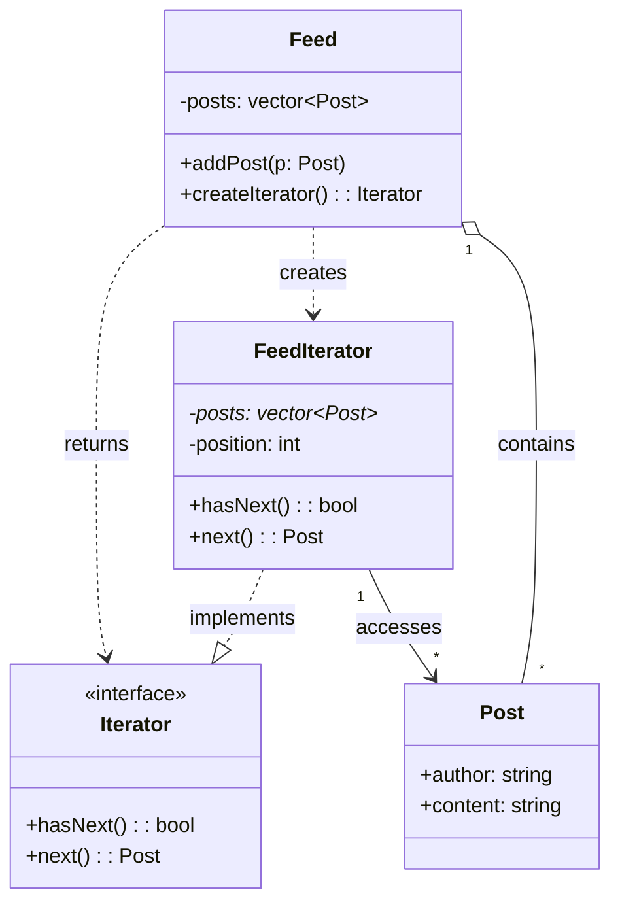
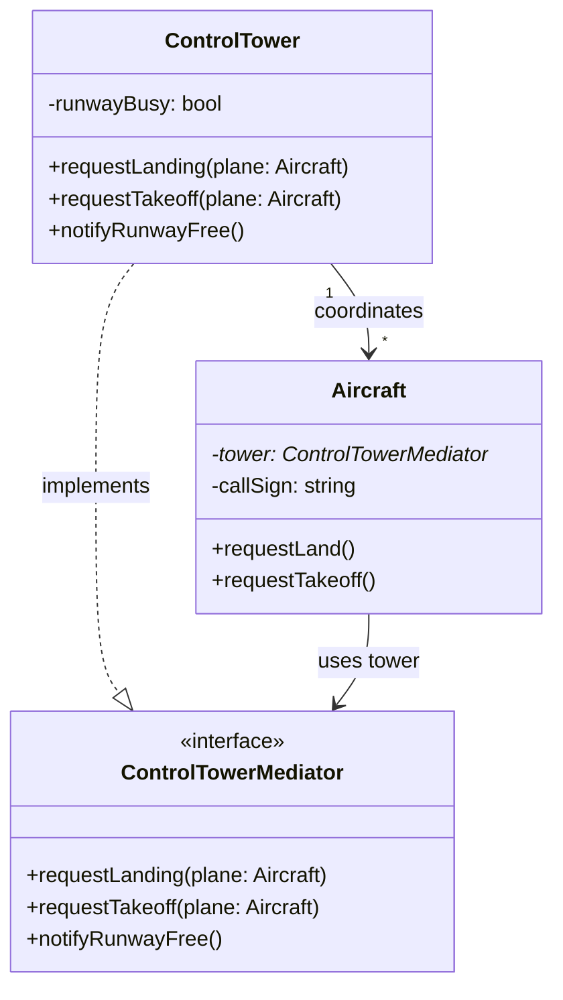

# Rajshahi University of Engineering and Technology
## Department of Computer Science & Engineering

### Software Engineering Sessional (CSE 3206)
**Experiment No:** 03  
**Date of Submission:** 18 August 2026  

---

### Meta Information

| **Submitted By** | **Submitted To** |
| :--- | :--- |
| **Name:** Apon Datta (2203019),<br>Emon Islam (2203020),<br>Sanjida Tabassum (2203021)<br>**Group:** 7<br>**Section:** A<br>**Series:** 22 | **Name:** Emrana Kabir Hashi<br>**Designation:** Assistant Professor<br>**Department:** CSE<br>**Institution:** RUET |

---

# Iterator Pattern

| Attribute | Details |
| :--- | :--- |
| **Pattern Name** | Iterator Pattern |
| **Category** | Behavioral Design Pattern |

## Intent
The Iterator Pattern provides a way to access the elements of a collection (an aggregate object) sequentially without exposing its underlying representation whether it is stored as an array, a linked list, or a tree. It separates the traversal logic from the collection itself so that the same collection can be traversed in different ways by different iterator implementations & the client never needs to know how the data is actually stored.

## When to Use
- You want to access a collection's elements without exposing its internal structure.
- You need multiple, independent traversals over the same collection at the same time.
- You want a uniform interface for traversing different collection types.
- You want to simplify the client code that would otherwise manage indices or pointers manually.
- You need to support new traversal algorithms without modifying the collection class.

## Real-World Applications
- Scrolling through a social media news feed (Facebook, Instagram, LinkedIn).
- Iterating over playlist tracks in a music player.
- Traversing files in a directory listing.
- Paginated search results in a web application.
- Iterating over rows in a database result set (JDBC ResultSet, STL iterators).

## Problem Scenario
Imagine building the back-end for a Social Media Feed System. Each user has a feed made up of Post objects stored internally in some collection like a vector. Different parts of the application need to scroll through the feed such as the main feed screen, a "read later" screen, an analytics module and each may want to traverse the posts in a different order or independently of the others.

If every part of the application accessed the internal vector directly using raw indices, the feed's internal storage could never change without breaking client code and each client would have to reimplement its own traversal and boundary-checking logic. This tightly couples clients to the internal representation and violates encapsulation.

The Iterator Pattern solves this by giving the Feed collection a `createIterator()` method that returns a `FeedIterator` object. Each client gets its own independent iterator with `hasNext()` and `next()` operations, so multiple clients can scroll through the same feed at their own pace without knowing how posts are actually stored internally.

## Participants
- **Iterator** : Declares the interface for traversal, typically `hasNext()` and `next()`.
- **ConcreteIterator (FeedIterator)** : Implements the Iterator interface and keeps track of the current traversal position.
- **Aggregate (Feed)** : Declares an interface for creating an Iterator object, e.g. `createIterator()`.
- **ConcreteAggregate** : The concrete collection (the Feed class itself) that stores Post objects and returns a `FeedIterator`.
- **Client** : Uses the Iterator interface to traverse the collection without knowing its internal structure.

## Example Code
The example below models a Social Media Feed. The Feed class (Aggregate) stores Post objects and is responsible only for creating a `FeedIterator`; it never exposes its internal `std::vector` directly. The `FeedIterator` (ConcreteIterator) implements `hasNext()` and `next()` to walk through the posts one at a time. So the client can scroll the feed without any knowledge of how posts are stored.

```cpp
#include <iostream>
#include <vector>
#include <string>
using namespace std;

class Post {
public:
    string author;
    string content;
    Post(string a, string c) : author(a), content(c) {}
};

// ----- Iterator Interface -----
class Iterator {
public:
    virtual bool hasNext() = 0;
    virtual Post next() = 0;
    virtual ~Iterator() {}
};

class Feed;

class FeedIterator : public Iterator {
private:
    vector<Post>* posts;
    int position;
public:
    FeedIterator(vector<Post>* p) {
        posts = p;
        position = 0;
    }
    bool hasNext() override {
        return position < (int)posts->size();
    }
    Post next() override {
        return posts->at(position++);
    }
};

class Feed {
private:
    vector<Post> posts;
public:
    void addPost(const Post& p) {
        posts.push_back(p);
    }
    Iterator* createIterator() {
        return new FeedIterator(&posts);
    }
};

int main() {
    Feed feed;
    feed.addPost(Post("Apon", "Just finished the Lab 3 report!"));
    feed.addPost(Post("Emon", "Studying Mediator pattern today."));
    feed.addPost(Post("Sanjida", "UML diagrams ready for the demo."));

    Iterator* it = feed.createIterator();
    while (it->hasNext()) {
        Post post = it->next();
        cout << post.author << ": " << post.content << "\n";
    }

    delete it;
    return 0;
}
```

## Code Explanation
- **Post** is the element type stored inside the collection. It plays no structural role in the pattern itself, it is simply the data being iterated over.
- **Iterator** declares the common traversal interface: `hasNext()` to check for remaining elements and `next()` to retrieve the current element and advance.
- **FeedIterator (ConcreteIterator)** stores a pointer to the collection and the current position, implementing the actual traversal logic.
- **Feed (Aggregate/ConcreteAggregate)** owns the `vector<Post>` and exposes only `createIterator()`. It never lets client code touch the vector directly.
- **main() (Client)** calls `feed.createIterator()` and loops using `hasNext()`/`next()`, completely unaware of how posts are stored internally.
- Because traversal is decoupled from storage, the Feed could switch to a linked list or a database cursor later and only `FeedIterator` would need to change. The client code in `main()` would remain untouched.

---

# Mediator Pattern

| Attribute | Details |
| :--- | :--- |
| **Pattern Name** | Mediator Pattern |
| **Category** | Behavioral Design Pattern |

## Intent
The Mediator Pattern defines an object that encapsulates how a set of other objects interact. Instead of objects referring to and communicating with each other directly which creates a tangled web of dependencies. They communicate only through the Mediator. This promotes loose coupling by keeping objects from referring to one another explicitly, and lets their interaction be varied independently.

## When to Use
- A set of objects communicate in well-defined but complex ways, creating many interdependencies.
- Reusing an object is difficult because it refers to and communicates with many other objects.
- You want to centralize control logic instead of scattering it across many classes.
- Behavior distributed between several classes should be customizable without a lot of subclassing.

## Real-World Applications
- Air traffic control tower coordinating aircraft take-offs and landings.
- Chat room applications where messages are routed through a central server.
- GUI dialog boxes where widgets communicate through a dialog controller.
- Smart-home hubs coordinating multiple connected devices.
- Air-traffic-style ride-sharing dispatch systems coordinating drivers and riders.

## Problem Scenario
Imagine building an Air Traffic Control System at an airport. Multiple aircraft need to request permission to land or take off. If every aircraft communicated directly with every other aircraft to check runway availability, the number of connections would grow rapidly as more planes are added & each Aircraft object would need a reference to every other Aircraft and any change to one plane's communication logic could ripple through all the others.

This tightly-coupled, many-to-many communication is fragile, hard to test & hard to extend with new aircraft or new rules. The Mediator Pattern solves this by introducing a `ControlTower` object. Every Aircraft communicates only with the `ControlTower`, requesting to land or take off and the tower decides whether the runway is free and coordinates the response. Aircraft never talk to each other directly.

## Participants
- **Mediator** : Declares an interface for communicating with Colleague objects, e.g. `notify()`.
- **ConcreteMediator (ControlTower)** : Implements cooperative behavior by coordinating Colleague objects and knows/maintains its colleagues.
- **Colleague** : Declares the interface each communicating object must implement, holding a reference to its Mediator.
- **ConcreteColleague (Aircraft)** : Each colleague communicates with its Mediator whenever it would otherwise have communicated with another colleague directly.

## Example Code
The example below models an Air Traffic Control Tower. Each Aircraft (ConcreteColleague) never talks to another aircraft directly. It only calls methods on its `ControlTower` (ConcreteMediator) which decides whether the runway is free and coordinates the response, keeping the aircraft loosely coupled from one another.

```cpp
#include <iostream>
#include <string>
using namespace std;

class Aircraft; // forward declaration

// ----- Mediator Interface -----
class ControlTowerMediator {
public:
    virtual void requestLanding(Aircraft* plane) = 0;
    virtual void requestTakeoff(Aircraft* plane) = 0;
    virtual void notifyRunwayFree() = 0;
    virtual ~ControlTowerMediator() {}
};

// ----- Colleague Interface -----
class Aircraft {
protected:
    ControlTowerMediator* tower;
    string callSign;
public:
    Aircraft(ControlTowerMediator* t, string sign) {
        tower = t;
        callSign = sign;
    }
    string getCallSign() { return callSign; }
    void requestLand() {
        tower->requestLanding(this);
    }
    void requestTakeoff() {
        tower->requestTakeoff(this);
    }
};

// ----- Concrete Mediator -----
class ControlTower : public ControlTowerMediator {
private:
    bool runwayBusy;
public:
    ControlTower() { runwayBusy = false; }
    void requestLanding(Aircraft* plane) override {
        if (!runwayBusy) {
            runwayBusy = true;
            cout << plane->getCallSign() << ": cleared to land.\n";
        } else {
            cout << plane->getCallSign() << ": hold, runway busy.\n";
        }
    }
    void requestTakeoff(Aircraft* plane) override {
        if (!runwayBusy) {
            runwayBusy = true;
            cout << plane->getCallSign() << ": cleared for takeoff.\n";
        } else {
            cout << plane->getCallSign() << ": hold, runway busy.\n";
        }
    }
    void notifyRunwayFree() override {
        runwayBusy = false;
        cout << "Control Tower: runway is now free.\n";
    }
};

int main() {
    ControlTower tower;
    Aircraft flightA(&tower, "BG-147");
    Aircraft flightB(&tower, "BG-202");

    flightA.requestLand(); // runway free -> cleared
    flightB.requestLand(); // runway busy -> hold
    tower.notifyRunwayFree();
    flightB.requestLand(); // runway free again -> cleared

    return 0;
}
```

## Code Explanation
- **ControlTowerMediator** declares the Mediator interface: `requestLanding()`, `requestTakeoff()`, and `notifyRunwayFree()`.
- **Aircraft (Colleague)** holds only a pointer to its Mediator; it never references other Aircraft objects directly.
- **ControlTower (ConcreteMediator)** implements the coordination logic tracking whether the runway is busy and deciding how each request is handled.
- When `flightA` and `flightB` call `requestLand()`, the call is routed entirely through `tower`. The two Aircraft objects never interact with one another.
- **main() (Client)** wires the aircraft to the shared tower and triggers requests demonstrating how new aircraft can be added without changing existing Aircraft or ControlTower code.
- This centralization means all coordination logic lives in one place, so adding new rules (e.g., priority landings) only requires modifying `ControlTower`.

---

# UML Diagrams, Advantages, Limitations & Industry Examples

## Combined UML Class Diagrams

### Iterator Pattern — Class Diagram



### Mediator Pattern — Class Diagram



---

## Advantages

### Iterator Pattern
- Supports multiple, simultaneous, independent traversals of the same collection.
- Hides the internal structure of the collection from client code (encapsulation).
- Provides a uniform interface for traversing different aggregate structures.
- Simplifies the Aggregate class by moving traversal responsibility into a separate object.

### Mediator Pattern
- Reduces coupling between communicating objects. Colleagues no longer reference each other.
- Centralizes control logic, making it easier to understand and maintain how objects interact.
- Simplifies object protocols by replacing many-to-many interactions with one-to-many.
- New colleague classes can be added without changing existing colleagues.

---

## 3.3 Limitations

### Iterator Pattern
- Adds extra classes and indirection for what could be a simple loop over a small collection.
- Concurrent modification of the collection while iterating can cause inconsistent traversal or errors.

### Mediator Pattern
- The Mediator itself can become a large, complex "god object" that is hard to maintain.
- Centralizing logic in one class can make the Mediator a single point of failure or a bottleneck.

---

## 3.4 Industry Examples

### Iterator Pattern
- C++ STL container iterators (`std::vector::iterator`, `std::list::iterator`).
- Java's `Iterable` / `Iterator` interfaces used across the Collections Framework.
- Database cursors (e.g., JDBC `ResultSet`) for row-by-row traversal of query results.
- Social media APIs (Facebook Graph API, Twitter/X API) that paginate and iterate feed data.

### Mediator Pattern
- Air traffic control systems coordinating multiple aircraft through a central tower.
- Chat applications (Slack, Discord) where a server mediates communication between clients.
- GUI frameworks where a dialog/controller class mediates between form widgets.
- Workflow/orchestration engines (e.g., Kubernetes control plane) coordinating many components.

---

# Pattern Comparison — Iterator vs. Mediator

Although both the Iterator and the Mediator are Behavioral design patterns, they solve very different structural problems. The Iterator manages how one collection is traversed, while the Mediator manages how many independent objects communicate. The table below summarizes the key differences discussed by the group.

| Aspect | Iterator Pattern | Mediator Pattern |
| :--- | :--- | :--- |
| **Category** | Behavioral | Behavioral |
| **Core Idea** | Provides sequential access to elements of a collection without exposing its internal structure. | Centralizes complex communication between a set of objects so they don't refer to each other directly. |
| **Problem Solved** | Traversal logic is tightly coupled with the collection, and multiple traversal types are hard to support. | Objects become tightly coupled with many-to-many references, making the system hard to maintain. |
| **Relationship Type** | One-to-many (Iterator to Collection elements). | Many-to-many (Colleagues communicate through one Mediator). |
| **Coupling Effect** | Decouples traversal algorithm from the collection. | Decouples colleague objects from each other. |
| **Typical Participants** | Iterator, ConcreteIterator, Aggregate, ConcreteAggregate. | Mediator, ConcreteMediator, Colleague, ConcreteColleague. |
| **Real-World Analogy** | Scrolling through a social media feed item-by-item. | An air traffic control tower coordinating aircraft. |
| **When to Prefer** | When you need multiple, independent ways to traverse a collection. | When many objects interact in complex ways and you want a single point of control. |

---

# Conclusion

Both the Iterator and Mediator patterns illustrate the idea of using Behavioral design patterns to increase the flexibility of software by controlling the interactions between objects. The Iterator Pattern separates the traversal of the data from its representation, like in the Social Media Feed example, so multiple clients can scroll through the data without being tied to the data's underlying structure. The Air Traffic Control Tower example demonstrated in the Mediator Pattern the separation of communicating objects from each other by placing the logic of communicating objects in one coordinating object, thereby avoiding a large number of many-to-many dependencies that would make the system fragile and difficult to extend.

Combined, these patterns represent the overall good design principle for an object-oriented design: extract what is causing tight coupling, such as traversal logic from a collection, or direct object communication to too many peers, into a separate object. This simplifies maintenance, extension with new features (new traversal orders, new aircraft or communication rules) and testing of both systems.

---

**Github Link:** [https://github.com/apondatta11/CSE_3206_Lab_3_Group_7](https://github.com/apondatta11/CSE_3206_Lab_3_Group_7)
