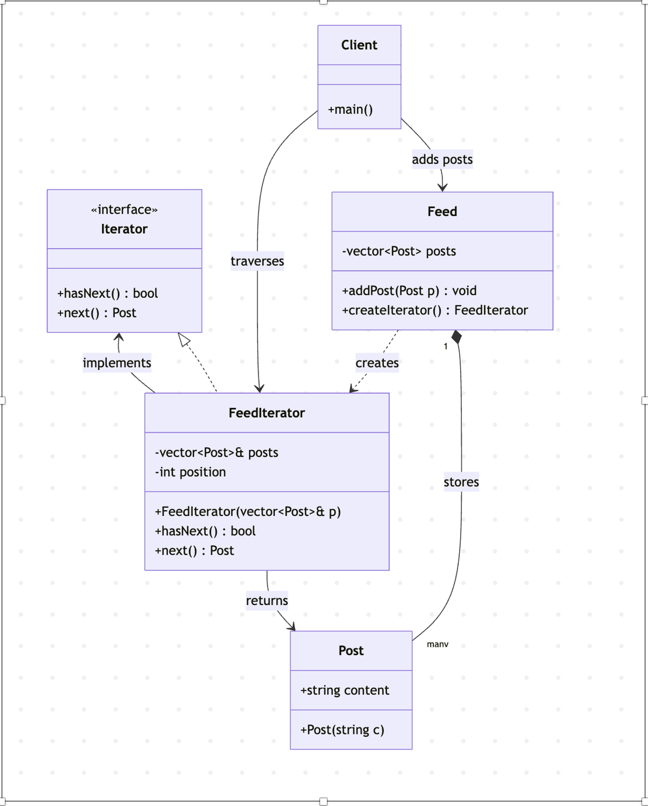
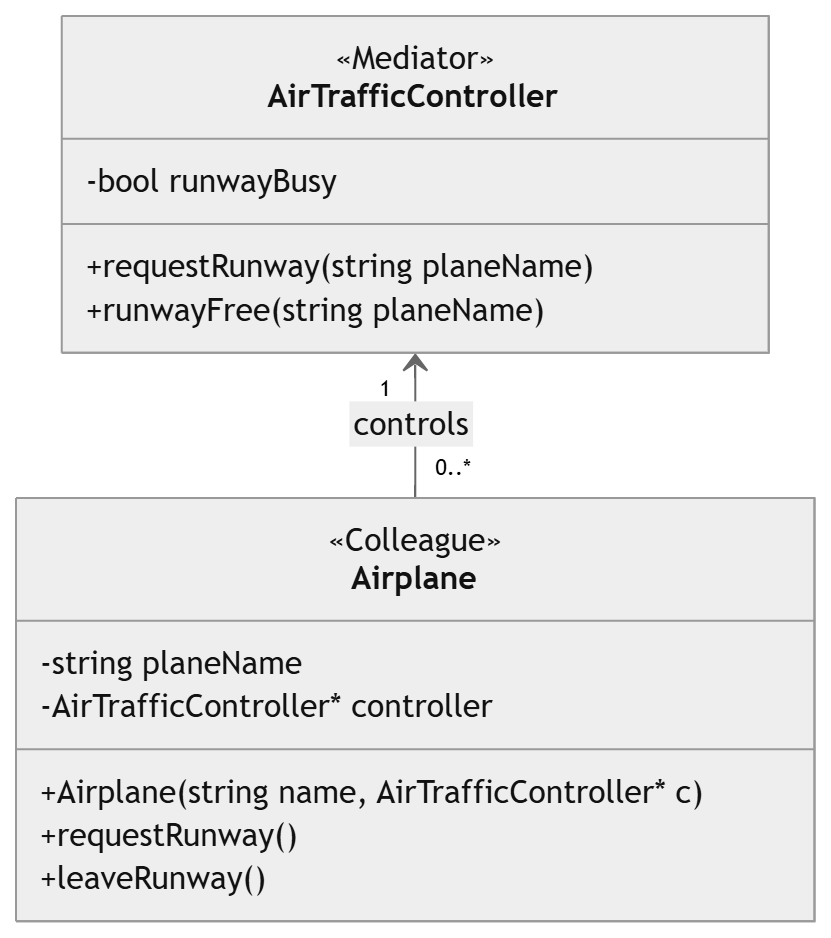

# Iterator Pattern

| Attribute | Details |
| :--- | :--- |
| **Pattern Name** | Iterator Pattern |
| **Category** | Behavioral Design Pattern |

## Intent
The Iterator Pattern provides a way to access the elements of a collection (an aggregate object) sequentially without exposing its underlying representation whether it is stored as an array, a linked list, or a tree. It separates the traversal logic from the collection itself so that the same collection can be traversed in different ways by different iterator implementations & the client never needs to know how the data is actually stored.

## When to Use
- You want to access a collection's elements without exposing its internal structure.
- You need multiple, independent traversals over the same collection at the same time.
- You want a uniform interface for traversing different collection types.
- You want to simplify the client code that would otherwise manage indices or pointers manually.
- You need to support new traversal algorithms without modifying the collection class.

## Real-World Applications
- Scrolling through a social media news feed (Facebook, Instagram, LinkedIn).
- Iterating over playlist tracks in a music player.
- Traversing files in a directory listing.
- Paginated search results in a web application.
- Iterating over rows in a database result set (JDBC ResultSet, STL iterators).

## Problem Scenario
Imagine building the back-end for a Social Media Feed System. Each user has a feed made up of Post objects stored internally in some collection like a vector. Different parts of the application need to scroll through the feed such as the main feed screen, a "read later" screen, an analytics module and each may want to traverse the posts in a different order or independently of the others.

If every part of the application accessed the internal vector directly using raw indices, the feed's internal storage could never change without breaking client code and each client would have to reimplement its own traversal and boundary-checking logic. This tightly couples clients to the internal representation and violates encapsulation.

The Iterator Pattern solves this by giving the Feed collection a `createIterator()` method that returns a `FeedIterator` object. Each client gets its own independent iterator with `hasNext()` and `next()` operations, so multiple clients can scroll through the same feed at their own pace without knowing how posts are actually stored internally.

## Participants
- **Iterator** : Declares the common interface for traversing the collection with `hasNext()` to check for remaining elements and `next()` to retrieve the next element.
- **ConcreteIterator (FeedIterator)** : Implements the Iterator interface. It maintains a reference to the collection of posts and keeps track of the current traversal position using the `position` variable.
- **Aggregate (Feed)** : Provides an interface for creating an Iterator through the `createIterator()` method.
- **ConcreteAggregate** : The concrete collection that stores the Post objects in a `vector<Post>`. It provides methods for adding posts and creating a `FeedIterator`.
- **Client** : Creates the Feed, adds posts, obtains an iterator through `createIterator()`, and uses `hasNext()` and `next()` to traverse the collection without directly accessing its internal vector.

## Example Code
The example below models a Social Media Feed. The Feed class acts as both the Aggregate and ConcreteAggregate, storing Post objects internally in a private `vector<Post>`. It provides the `createIterator()` method to create a `FeedIterator` without exposing the internal collection to the client.

The `FeedIterator` acts as the ConcreteIterator and implements the `hasNext()` and `next()` methods. It maintains the current traversal position and provides the posts one at a time.

The `main()` function acts as the Client. It obtains an iterator from the Feed and uses the iterator to traverse the posts, without needing to know that the Feed internally uses a vector.

```cpp
#include <iostream>
#include <vector>
using namespace std;

class Post {
public:
    string content;
    Post(string c) {
        content = c;
    }
};

class Iterator {
public:
    virtual bool hasNext() = 0;
    virtual Post next() = 0;
};

class FeedIterator : public Iterator {
private:
    vector<Post>& posts;
    int position = 0;
public:
    FeedIterator(vector<Post>& p) : posts(p) {}
    bool hasNext() override {
        return position < posts.size();
    }
    Post next() override {
        return posts[position++];
    }
};

class Feed {
private:
    vector<Post> posts;
public:
    void addPost(Post p) {
        posts.push_back(p);
    }
    FeedIterator createIterator() {
        return FeedIterator(posts);
    }
};

int main() {
    Feed feed;
    feed.addPost(Post("Hello from Apon"));
    feed.addPost(Post("Hello from Emon"));
    feed.addPost(Post("Hello from Sanjida"));

    FeedIterator iterator = feed.createIterator();
    while (iterator.hasNext()) {
        cout << iterator.next().content << endl;
    }
    return 0;
}
```

## Code Explanation
- **Post** is the element type stored inside the collection. It contains the post content and represents the data that will be iterated over. It plays no structural role in the pattern itself, it is simply the data being iterated over.
- **Iterator** declares the common traversal interface: `hasNext()` checks whether more elements are available, while `next()` retrieves the current element and moves the iterator to the next position.
- **FeedIterator (ConcreteIterator)** implements the Iterator interface. It keeps a reference to the Feed's collection of posts and maintains a position variable to keep track of the current element during traversal.
- **Feed (Aggregate/ConcreteAggregate)** owns the `vector<Post>` that stores all the posts. It provides `addPost()` to add posts and `createIterator()` to create and return a `FeedIterator`. The internal vector remains private, so the client cannot access it directly.
- **main() (Client)** creates the Feed, adds posts, and requests an iterator using `feed.createIterator()`. It then uses `hasNext()` and `next()` to traverse the posts without knowing how the posts are internally stored.
- As the traversal logic is separated from the Feed's storage, the Feed's internal collection can potentially be changed without requiring changes to the client. The client continues to use the same `hasNext()` and `next()` operations, while the concrete iterator can handle the new storage mechanism.

---

# Mediator Pattern

| Attribute | Details |
| :--- | :--- |
| **Pattern Name** | Mediator Pattern |
| **Category** | Behavioral Design Pattern |

## Intent
The Mediator Pattern defines an object that encapsulates how a set of other objects interact. Instead of objects referring to and communicating with each other directly which creates a tangled web of dependencies. They communicate only through the Mediator. This promotes loose coupling by keeping objects from referring to one another explicitly, and lets their interaction be varied independently.

## When to Use
- Many objects communicate with each other in complex ways.
- Reusing objects is difficult because they depend on many other objects.
- Control logic should be kept in one central place.
- The behavior should be easy to change without creating many subclasses.

## Real-World Applications
- **Air Traffic**: Tower controls aircraft take-off and landing.
- **Chat Room**: Server manages messages between users.
- **GUI**: Dialog controller manages different widgets.
- **Smart Home**: Hub controls connected devices.
- **Ride Sharing**: System connects drivers and riders.

## Problem Scenario
Imagine building an Air Traffic Control System at an airport. Multiple aircraft need to request permission to land or take off. If every aircraft communicated directly with every other aircraft to check runway availability, the number of connections would grow rapidly as more planes are added & each Aircraft object would need a reference to every other Aircraft and any change to one plane's communication logic could ripple through all the others.

This tightly-coupled, many-to-many communication is fragile, hard to test & hard to extend with new aircraft or new rules. The Mediator Pattern solves this by introducing a `ControlTower` object. Every Aircraft communicates only with the `ControlTower`, requesting to land or take off and the tower decides whether the runway is free and coordinates the response. Aircraft never talk to each other directly.

## Participants
- **Mediator** : `AirTrafficController` controls communication between the airplanes using `requestRunway()` and `runwayFree()`.
- **ConcreteMediator** : `AirTrafficController` checks whether the runway is busy and decides which airplane can use it.
- **Colleague** : `Airplane` represents an aircraft and communicates with the `AirTrafficController`.
- **ConcreteColleague** : `Airplane` requests runway permission and informs the controller when it leaves the runway.

## Example Code
The example below models an Air Traffic Control System. Each Airplane communicates only with the `AirTrafficController` and never directly with another airplane. The `AirTrafficController` checks whether the runway is busy and decides whether an airplane can use it. This keeps the airplanes independent from each other and makes the system simple and easy to manage.

```cpp
#include <iostream>
using namespace std;

// Mediator
class AirTrafficController {
private:
    bool runwayBusy = false;

public:
    void requestRunway(string planeName) {
        if (!runwayBusy) {
            runwayBusy = true;
            cout << planeName << " can use the runway." << endl;
        }
        else {
            cout << planeName << " must wait." << endl;
        }
    }

    void runwayFree(string planeName) {
        runwayBusy = false;
        cout << planeName << " has left the runway." << endl;
    }
};

// Airplane
class Airplane {
private:
    string planeName;
    AirTrafficController* controller;

public:
    Airplane(string name, AirTrafficController* c) {
        planeName = name;
        controller = c;
    }

    void requestRunway() {
        controller->requestRunway(planeName);
    }

    void leaveRunway() {
        controller->runwayFree(planeName);
    }
};

int main() {

    AirTrafficController controller;

    Airplane planeA("Plane A", &controller);
    Airplane planeB("Plane B", &controller);

    planeA.requestRunway();
    planeB.requestRunway();

    planeA.leaveRunway();

    planeB.requestRunway();

    return 0;
}
```

## Code Explanation
- **AirTrafficController**: Acts as the Mediator and manages communication between the airplanes.
- **runwayBusy**: Stores the current status of the runway—busy or free.
- **requestRunway()**: Checks the runway. If it is free, the airplane gets permission; otherwise, it must wait.
- **runwayFree()**: Makes the runway free when an airplane leaves it.
- **Airplane Class**: Represents an aircraft and stores its name and controller.
- **requestRunway()**: Sends a request from the airplane to the controller.
- **leaveRunway()**: Informs the controller that the airplane has left the runway.
- **main()**: Creates the controller and two airplanes, then shows how they use the runway.
- **Main Idea**: Airplanes do not communicate directly. The `AirTrafficController` manages all communication and runway access.

---

# UML Diagrams, Advantages, Limitations & Industry Examples

## Combined UML Class Diagrams

### Iterator Pattern — Class Diagram




### Mediator Pattern — Class Diagram




## Advantages

### Iterator Pattern
- Supports multiple, simultaneous, independent traversals of the same collection.
- Hides the internal structure of the collection from client code (encapsulation).
- Provides a uniform interface for traversing different aggregate structures.
- Simplifies the Aggregate class by moving traversal responsibility into a separate object.

### Mediator Pattern
- Reduces coupling between communicating objects. Colleagues no longer reference each other.
- Centralizes control logic, making it easier to understand and maintain how objects interact.
- Simplifies object protocols by replacing many-to-many interactions with one-to-many.
- New colleague classes can be added without changing existing colleagues.

---

## Limitations

### Iterator Pattern
- Adds extra classes and indirection for what could be a simple loop over a small collection.
- Concurrent modification of the collection while iterating can cause inconsistent traversal or errors.

### Mediator Pattern
- The Mediator itself can become a large, complex "god object" that is hard to maintain.
- Centralizing logic in one class can make the Mediator a single point of failure or a bottleneck.

---

## Industry Examples

### Iterator Pattern
- C++ STL container iterators (`std::vector::iterator`, `std::list::iterator`).
- Java's `Iterable` / `Iterator` interfaces used across the Collections Framework.
- Database cursors (e.g., JDBC `ResultSet`) for row-by-row traversal of query results.
- Social media APIs (Facebook Graph API, Twitter/X API) that paginate and iterate feed data.

### Mediator Pattern
- Air traffic control systems coordinating multiple aircraft through a central tower.
- Chat applications (Slack, Discord) where a server mediates communication between clients.
- GUI frameworks where a dialog/controller class mediates between form widgets.
- Workflow/orchestration engines (e.g., Kubernetes control plane) coordinating many components.

---

# Pattern Comparison — Iterator vs. Mediator

Although both the Iterator and the Mediator are Behavioral design patterns, they solve very different structural problems. The Iterator manages how one collection is traversed, while the Mediator manages how many independent objects communicate. The table below summarizes the key differences discussed by the group.

| Aspect | Iterator Pattern | Mediator Pattern |
| :--- | :--- | :--- |
| **Category** | Behavioral | Behavioral |
| **Core Idea** | Provides sequential access to elements of a collection without exposing its internal structure. | Centralizes complex communication between a set of objects so they don't refer to each other directly. |
| **Problem Solved** | Traversal logic is tightly coupled with the collection, and multiple traversal types are hard to support. | Objects become tightly coupled with many-to-many references, making the system hard to maintain. |
| **Relationship Type** | One-to-many (Iterator to Collection elements). | Many-to-many (Colleagues communicate through one Mediator). |
| **Coupling Effect** | Decouples traversal algorithm from the collection. | Decouples colleague objects from each other. |
| **Typical Participants** | Iterator, ConcreteIterator, Aggregate, ConcreteAggregate. | Mediator, ConcreteMediator, Colleague, ConcreteColleague. |
| **Real-World Analogy** | Scrolling through a social media feed item-by-item. | An air traffic control tower coordinating aircraft. |
| **When to Prefer** | When you need multiple, independent ways to traverse a collection. | When many objects interact in complex ways and you want a single point of control. |

---

# Conclusion

Both the Iterator and Mediator patterns illustrate the idea of using Behavioral design patterns to increase the flexibility of software by controlling the interactions between objects. The Iterator Pattern separates the traversal of the data from its representation, like in the Social Media Feed example, so multiple clients can scroll through the data without being tied to the data's underlying structure. The Air Traffic Control Tower example demonstrated in the Mediator Pattern the separation of communicating objects from each other by placing the logic of communicating objects in one coordinating object, thereby avoiding a large number of many-to-many dependencies that would make the system fragile and difficult to extend.

Combined, these patterns represent the overall good design principle for an object-oriented design: extract what is causing tight coupling, such as traversal logic from a collection, or direct object communication to too many peers, into a separate object. This simplifies maintenance, extension with new features (new traversal orders, new aircraft or communication rules) and testing of both systems.

---

**Github Link:** [https://github.com/apondatta11/CSE_3206_Lab_3_Group_7](https://github.com/apondatta11/CSE_3206_Lab_3_Group_7)
